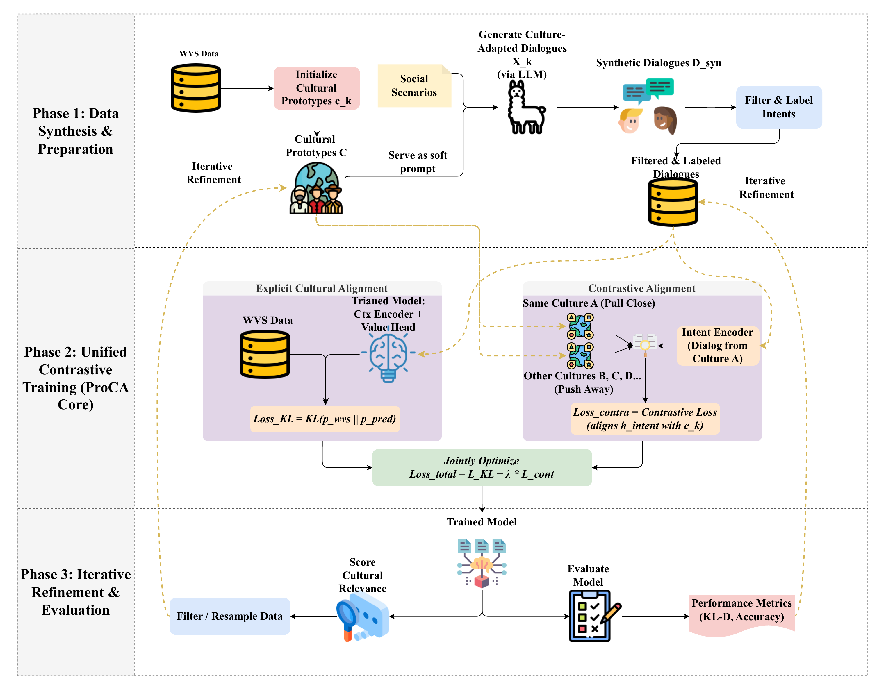

<h1 align="center">ProCA</h1>

<p align="center">
  <strong>Is Prompting Enough for Cultural Alignment?</strong>
</p>

<p align="center">
  <strong>Learning Prototype-Aware Values with Contrastive Adaptation in Large Language Models</strong>
</p>

<p align="center">
  <a href="LICENSE"></a>
  <a href="pyproject.toml"></a>
</p>

<p align="center">
  <a href="#motivation">Motivation</a> |
  <a href="#method">Method</a> |
  <a href="#quick-start">Quick Start</a> |
  <a href="#reproducing-the-experiments">Experiments</a> |
  <a href="#citation">Citation</a>
</p>

ProCA is a research codebase for cultural alignment beyond inference-time
prompting. Instead of asking a model to "act as" a culture at test time, ProCA
learns a prototype-aware value space anchored in aggregate World Values Survey
(WVS) response distributions. The framework uses these prototypes to generate
culture-adapted social interactions, jointly optimizes explicit WVS alignment
and contrastive cultural separation, and refines the training set with the
model's own cultural-relevance scores.

The repository is designed for both full experiments and lightweight
reproducibility: every major pipeline has a CPU-friendly mock path, so the full
train, score, refine, and evaluate loop can be smoke-tested without downloading
large backbones.

## At a Glance

- **Research question.** Is prompting alone sufficient for cultural alignment across values, norms, and everyday knowledge?
- **Core idea.** ProCA learns prototype-aware cultural representations with contrastive adaptation rather than relying only on prompt templates.
- **What is included.** Training, evaluation, ablations, cross-lingual transfer settings, and ethics notes for cultural-alignment experiments.

## Motivation

Prompting can steer surface behavior, but cultural alignment requires a model to
represent how value distributions differ across social contexts. ProCA treats
each culture as a survey-derived prototype and trains the model to pull
matching dialogues toward the right prototype while pushing mismatched cultural
signals apart.


## Method

ProCA has three stages. First, WVS responses are projected into a compact
cultural prototype space and used to guide synthetic social dialogue generation.
Second, a unified adaptation objective combines distributional WVS alignment
with prototype-aware contrastive learning. Third, the trained model scores the
cultural relevance of generated dialogues, filters or resamples training data,
and repeats the adaptation loop.



The original vector version of the pipeline figure is available at
[assets/proca_architecture.pdf](assets/proca_architecture.pdf).

## Key Contributions

| Capability | What is included |
| --- | --- |
| Survey-grounded prototypes | WVS-based cultural prototype construction and mock fixtures for fast testing |
| Social interaction synthesis | Scenario-conditioned dialogue generation with pluggable teacher backends |
| Unified adaptation objective | KL alignment to WVS answer distributions plus prototype-aware contrastive loss |
| Iterative refinement | Cultural-relevance scoring, filtering, and resampling across refinement rounds |
| Evaluation suite | WVS alignment, cross-lingual transfer, prompt baselines, and ablation entry points |
| Reproducible smoke tests | CPU-only mock training and evaluation paths for CI and local checks |

## Installation

```bash
git clone git@github.com:Hik289/Is_prompting.git
cd Is_prompting

python3 -m venv .venv
source .venv/bin/activate

pip install -r requirements.txt
# or install the package in editable mode:
pip install -e .[dev]
```

GPU training uses PyTorch, Transformers, and PEFT. The mock mode below runs on
CPU and is intended for CI, reviewers, and quick repository checks.

## Quick Start

Run the test suite:

```bash
pytest tests/ -v
```

Run the full pipeline on bundled mock data:

```bash
python -m proca.train --config configs/proca_default.yaml --mock --dry-run
```

The mock path replaces large HuggingFace backbones with a tiny random-init
transformer and uses bundled WVS/Sotopia fixtures. The dry run caps the number
of optimization steps, so the complete train, score, refine, and retrain loop
finishes quickly on a laptop.

Evaluate a trained or mock checkpoint on one culture:

```bash
python -m proca.eval.wvs_eval --culture China --mock
```

Run the all-in-one smoke scripts:

```bash
bash scripts/train_proca.sh   --mock --dry-run
bash scripts/eval_all.sh      --mock
bash scripts/run_ablations.sh --mock --dry-run
```

## Training on Real Data

1. Place WVS Wave 7 responses at `data/wvs_wave7.csv`. The loader expects a
   culture column and integer WVS answer columns.
2. Place Sotopia-style scenario templates at `data/sotopia_scenarios.json`.
3. Wire up a teacher backend in `proca/synthesis.py`. The repository keeps
   external OpenAI/vLLM calls as hooks so the mock path remains fully local.
4. Set the real backbone IDs in `configs/proca_default.yaml` under
   `ucca.context_encoder.backbone` and `ucca.intent_encoder.backbone`. The
   files in `configs/models/` record the model metadata used for experiments.
5. Launch training:

```bash
python -m proca.train --config configs/proca_default.yaml
```

Current model-card templates cover GPT-OSS, Qwen3, and Gemma3 families for
documentation and experiment tracking. The default configuration uses five
cultures: China, Germany, United Kingdom, Mexico, and Japan.

## Configuration

Core hyperparameters are collected in
[configs/proca_default.yaml](configs/proca_default.yaml).

| Setting | Default |
| --- | --- |
| Prototype dimension | 128 |
| Contrastive weight | 0.5 |
| Contrastive temperature | 0.07 |
| LoRA rank / alpha | 64 / 128 |
| Learning rate | 2e-5 |
| Batch size | 32 |
| Epochs | 3 |
| Refinement rounds | 2 |
| Top-K retain ratio | 0.70 |
| Dialogue length | 6-12 turns |
| Personas per culture | 1000 |
| WVS questions | 44 |

## Reproducing the Experiments

| Experiment | Entry point |
| --- | --- |
| WVS alignment across cultures and backbones | `bash scripts/eval_all.sh --ckpt <path>` |
| Prompting baselines | `python -m proca.eval.wvs_eval --culture <name> --baseline cultural` |
| Cross-lingual transfer | `python -m proca.eval.xling_eval --culture <name>` |
| Dialogue-only ablation | `python -m proca.ablations.dialogue_only` |
| Intent-only ablation | `python -m proca.ablations.intent_only` |
| Reasoning-only fine-tuning baseline | `python -m proca.ablations.reasoning_only --dataset gsm8k_mock` |
| Teacher-model robustness | `python -m proca.ablations.teacher_swap --teacher qwen3_32b` |

## Repository Structure

```text
configs/                YAML configuration files and model cards
data/                   Lightweight fixtures for mock runs
proca/                  Library source
  prototypes.py         Cultural prototype construction
  synthesis.py          Culture-adapted dialogue synthesis
  encoders.py           Context, intent, and value encoders
  losses.py             KL, contrastive, and unified objectives
  model.py              ProCA model wrapper
  refinement.py         Cultural-relevance scoring and filtering
  train.py              Training and refinement loop
  eval/                 WVS, cross-lingual, and baseline evaluation
  ablations/            Ablation entry points
scripts/                Reproduction scripts
tests/                  CPU-friendly pytest suite
assets/                 README figures
```

## Ethics

ProCA aligns models to aggregate survey distributions, not to prescriptive
cultural norms. Aggregate trends should not be treated as claims about
individual people, and cultural contextualization should not override universal
safety, fairness, or human-rights constraints. We recommend human-supervised
deployment and careful reporting of population-level assumptions.

## Citation

If this repository is useful for your work, please cite the accompanying paper:

**Is Prompting Enough for Cultural Alignment? Learning Prototype-Aware Values
with Contrastive Adaptation in Large Language Models**

BibTeX will be added here once the public manuscript metadata is released.

## License

This project is released under the MIT License. See [LICENSE](LICENSE).
